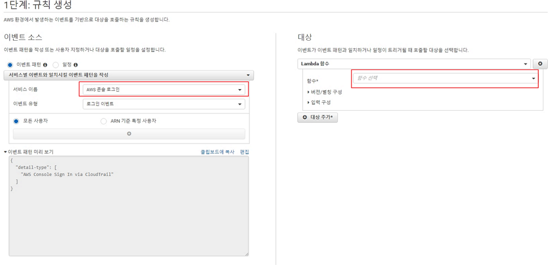

# AWS Login 알림 만들기 

AWS에 Login을 하면 자동으로 Salck으로 Webhook을 통하여 로그인에 대한 이벤트을 알림으로 알리기 입니니다.AWS에서는 최소 MFA을 권장하고 있습니다. 그리고 IAM User을 생성하여 사용을 권장 하고 있습니다.사용자는 MFA보다 ID/PASS을 사용 하여 로그인을 많이 사용 하고 있습니다.ID/PASS가 노출 되어 다른 사람이 사용시 최소한으로 알리 위하여 여러 방법이 있습니다.별안간 해커에 의하여 다른 리전에 리소스을 생성하여 사용 한 다음 삭제 하고 해커가 도망 가면,
월말에 사용요금에 폭탄을 맞기도 합니다. 이러한 사항을 방지 하기 위하여 누군가 나의 계정에 로그인을 하연 Salck으로 메세자을 받는 방법으로 나 이외에 누가 로그인 했는지 알기 위한 기능을 아래와 같이 구현을 하였습니다.

설명및 개발 방법은 초급자을 위한 방법 입니다. 

사용 서비스는 AWS Lambda, Slack 을 사용 하였습니다. Salck 대신에 SMS 방송 및 E-Mail을 통해서 받을수 있지만 우선 Salck으로 구현을 해 보았습니다.

## 1. 사용 기술

#### 	1. Slack

####     2. AWS Lambda

## 2. 구현

 1. Slack   ( URL : https://api.slack.com/messaging/webhooks   참고 )

 2. AWS Lambda

     1. regin ( [미국 동부 (버지니아 북부)us-east-1 ) 로 이동 

     2. Lambda 메뉴로 이동 

     3.  함수 >  버튼 클릭 

     4.  
        
        함수 이름 : "Login_alert"
        
        런타임 :  "Python 3.8"

     5. "Lambda_code\lambda_function.py" 내용 입력
     6. "Deploy" 클릭 하여 배포 

 3. CloudWatch 설정 
    1. CloudWatch 메뉴로 이동 
    
    2.   "이벤트 >> 규칙" 메뉴로 이동 
    
    3.  버튼 클릭 
    
    4. 
    
       
    
       ​		서비스 이름 : "AWS 콘솔 로그인"  선택
    
       ​       함수 : "Login_alert" 선택 ( Lambda 로 만든 함수 이름)
    
       ​	
    
       5.   버튼 클릭 
       
       6. 
       
          이름 : "login_alert" 입력 
       
          "규칙생성 " Click 하여 완료 
    
## 3. 사용 방법 및 테스트
   1. AWS에 Login 한다.
   2. Salck Message을 확인 한다.

